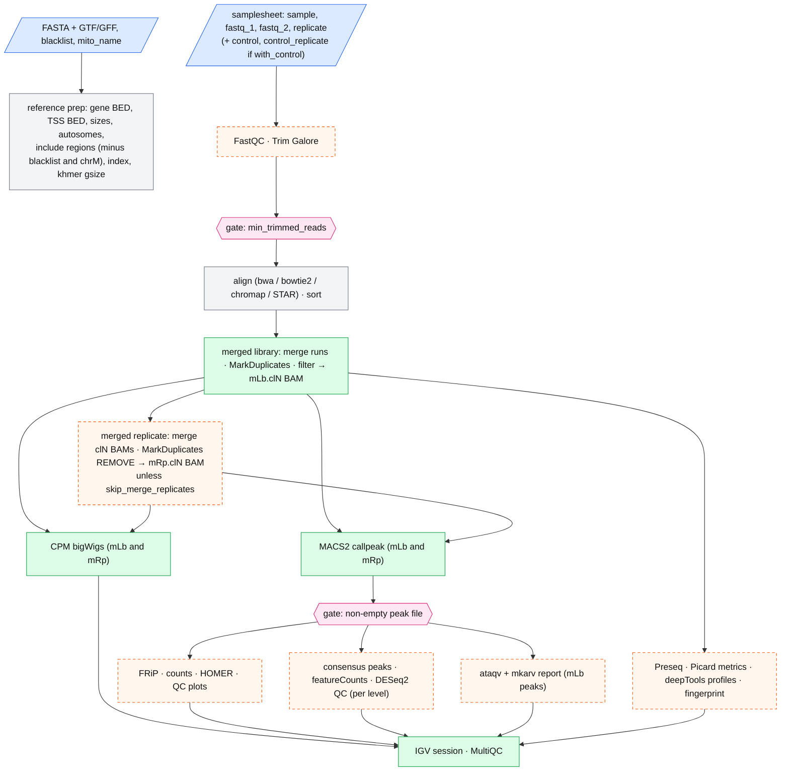
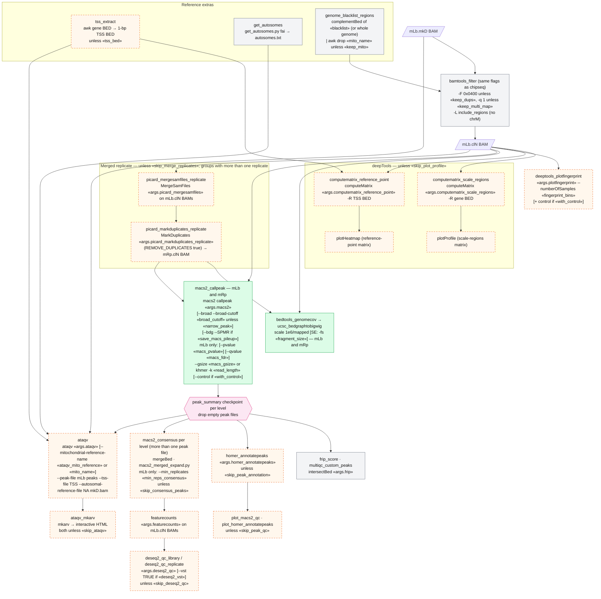
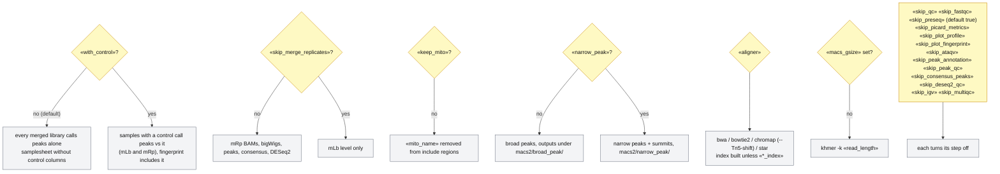

# snk-atacseq — pipeline diagrams

Snakemake port of **nf-core/atacseq 2.1.2**. These diagrams show the flow of commands and data
through `Snakefile`, and how each key in `config/config.yaml` changes those commands. They are
written in Mermaid. You can view them on GitHub, in VS Code (with a Mermaid preview extension),
or by opening `DIAGRAMS.html` in a browser.

**How to read them**

- `«key»` is a value from `config/config.yaml`. `«args.X»` is the fixed tool argument string under `args:` (nf-core `ext.args`).
- Dashed orange boxes run only under some settings. Pink hexagons are **gates** (checkpoints that drop libraries or samples).
- Levels: a **library** (`_T<m>`) is one samplesheet row. A **merged library** (`.mLb.`) is one replicate. A **merged replicate** (`.mRp.`) is all replicates of a sample. Peaks are called at both the mLb and the mRp level.
- Reads → filtered BAM is the same as in snk-chipseq (see `../snk-chipseq/DIAGRAMS.md`, figure 2b), with the ATAC-specific differences shown here.

---

## 1. Analysis overview

---

## 2. Command flow — ATAC-specific steps

---

## 3. How config switches shape the run

---

## 4. Config key reference (ATAC-specific; shared keys behave as in snk-chipseq)

| Key | Rule(s) | Effect on the command |
|---|---|---|
| `with_control` | samplesheet check, macs2_callpeak, plotFingerprint | Read control columns and call peaks vs controls. |
| `tss_bed` | tss_extract, computeMatrix reference-point, ataqv | Given TSS BED; otherwise derived from the gene BED. |
| `mito_name`, `keep_mito` | genome_blacklist_regions | Drop the mitochondrial contig from the include regions unless kept. |
| `ataqv_mito_reference` | ataqv | `--mitochondrial-reference-name` (falls back to `mito_name`). |
| `skip_merge_replicates` | merged-replicate rules | Turn off the mRp level. |
| `macs_fdr`, `macs_pvalue` | macs2_callpeak | `--qvalue` / `--pvalue`, merged-library level only. |
| `min_reps_consensus` | macs2_consensus | `--min_replicates`, merged-library consensus only. |
| `skip_ataqv` | ataqv, ataqv_mkarv | Turn ataqv off. |
| `skip_preseq` | preseq_lcextrap | Default `true` here. |
| `args.picard_markduplicates_library` / `_replicate` | picard_markduplicates_* | Duplicates are marked (mLb) or removed (mRp). |
| `args.computematrix_scale_regions` / `_reference_point` | deeptools_computematrix_* | Gene-body and TSS profiles. |
| `args.chromap` | chromap | Includes `--Tn5-shift`. |
| `args.macs2`, `args.ataqv` | macs2_callpeak, ataqv | `--keep-dup all --nomodel`; `--ignore-read-groups`. |
| other keys (`fasta`, `gtf`, `aligner`, trimming, `keep_dups`, `keep_multi_map`, `fragment_size`, `narrow_peak`, `save_*`, `resources`, ...) | — | Same as `snk-chipseq/DIAGRAMS.md`, section 4. |

To regenerate the real rule DAG: `snakemake --configfile config/test.yaml --rulegraph mermaid-js > rulegraph.mmd`
(rules after the checkpoints appear only once those have run).
