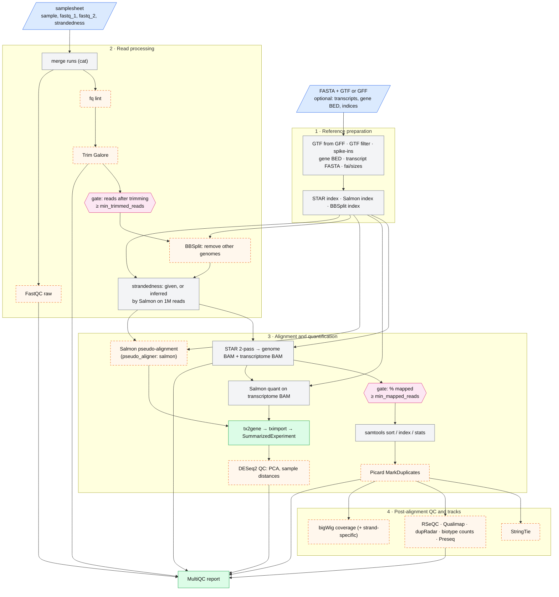
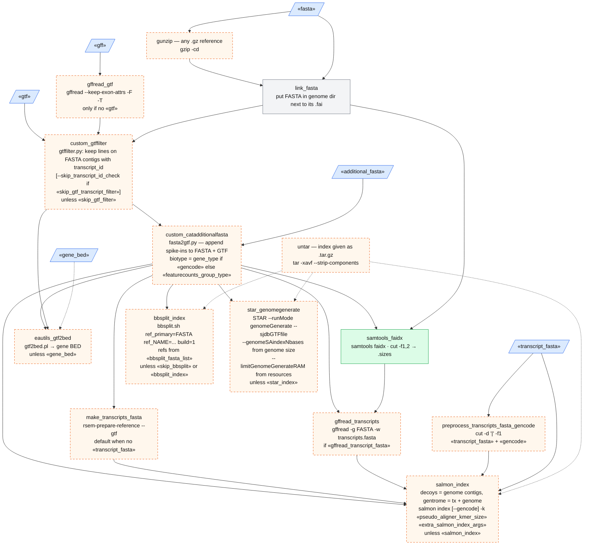
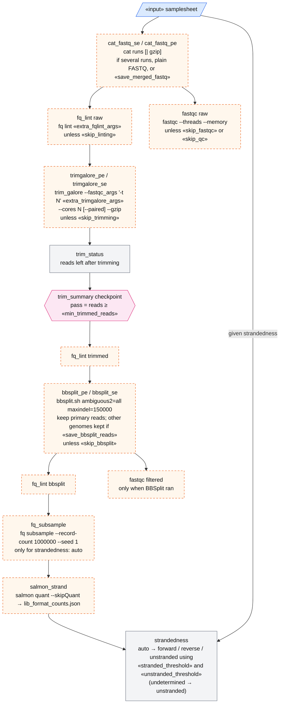
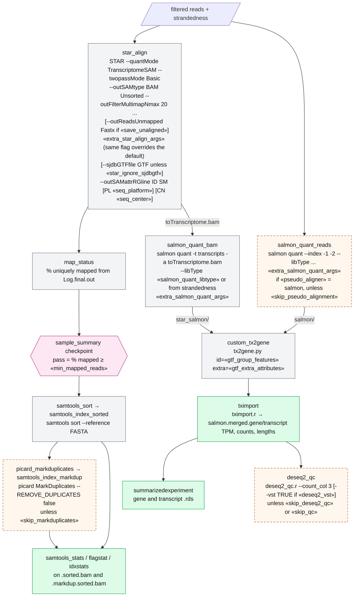
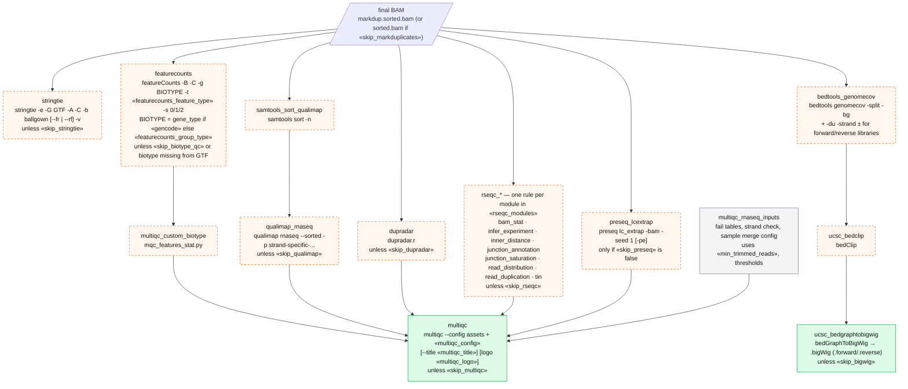
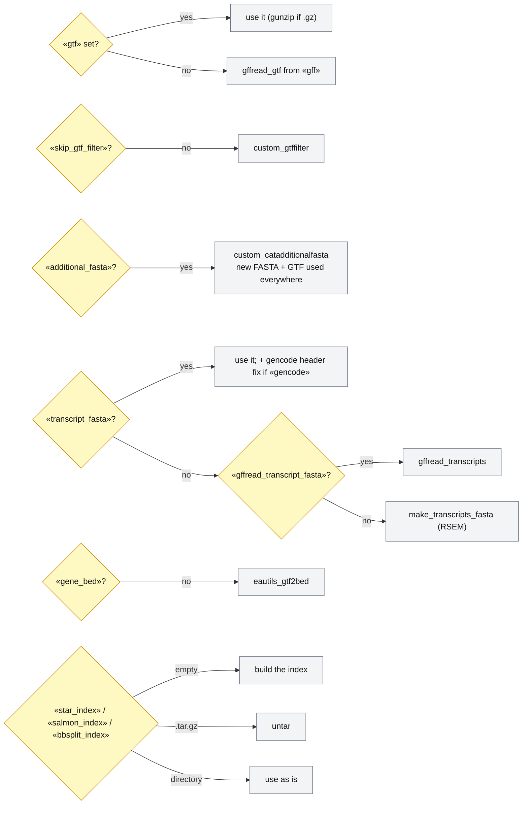
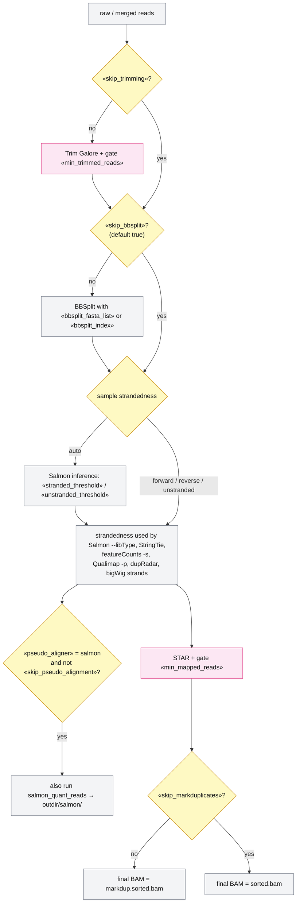
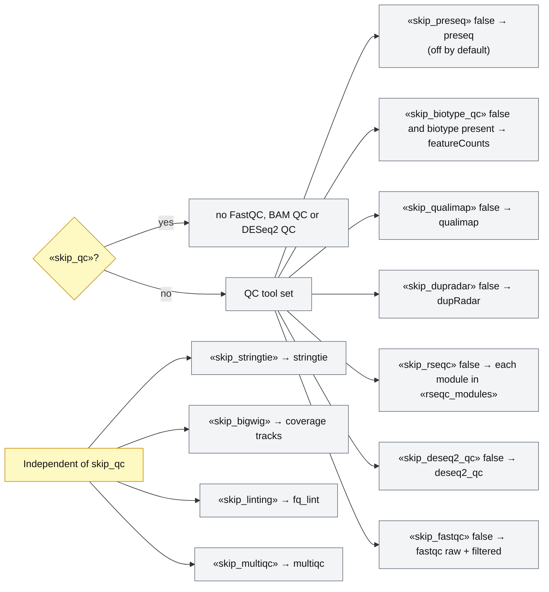

# snk-rnaseq — pipeline diagrams

Snakemake port of **nf-core/rnaseq 3.27.0**, using the default route: `aligner: star_salmon` and
`trimmer: trimgalore`, plus BBSplit, `additional_fasta` and the optional Salmon pseudo-alignment.
These diagrams show the flow of commands and data through `Snakefile`, and how each key in
`config/config.yaml` changes those commands. They are written in Mermaid. You can view them on
GitHub, in VS Code (with a Mermaid preview extension), or by opening `DIAGRAMS.html` in a browser.

**How to read them**

- `«key»` inside a command is a value that comes straight from `config/config.yaml`.
- Dashed orange boxes are rules that only run under some settings (the condition is on the box).
- Pink hexagons are **gates**: aggregate checkpoints that drop samples which fail a threshold.
- Each rule runs in the image given by `config/containers.yaml`.
- `outdir` holds the files nf-core publishes; `workdir` holds intermediates that nf-core keeps in `work/`.

---

## 1. Analysis overview



The `min_trimmed_reads` gate drops a sample from every later step. The `min_mapped_reads`
gate only drops it from MarkDuplicates onward: Salmon quantification still includes every
sample that passed trimming (as in nf-core).

---

## 2. Command flow (what each rule runs)

### 2a · Reference preparation (PREPARE_GENOME)



Without `additional_fasta`, the filtered GTF and the linked FASTA feed every downstream rule
directly (the `custom_catadditionalfasta` box is skipped). `save_reference: true` writes all of
these to `outdir/genome/` instead of `workdir/genome/`.

### 2b · Read processing (FASTQ_QC_TRIM_FILTER_SETSTRANDEDNESS)



Each `fq_lint` report is an input of the next stage, so a lint failure stops that sample, as
in nf-core. With `skip_trimming` or `skip_bbsplit`, the reads skip that box and the gate.

### 2c · Alignment and quantification



tx2gene, tximport, SummarizedExperiment and DESeq2 QC run once per quantifier directory:
`star_salmon/` always, and also `salmon/` with pseudo-alignment.

### 2d · BAM QC, transcript assembly and coverage



`skip_qc: true` turns off every QC box here (and FastQC and DESeq2 QC), but not StringTie or bigWigs.

---

## 3. How config switches shape the run

Colours: yellow = config key, blue = value derived in the Snakefile, grey = rules affected.

### 3a · Which reference files are built



### 3b · Which samples and read stages go forward



### 3c · Which QC tools run



---

## 4. Config key reference

| Key | Rule(s) | Effect on the command |
|---|---|---|
| `input` | all per-sample rules, summarizedexperiment | Samplesheet. Rows with the same `sample` are runs, concatenated by `cat_fastq_*`. `strandedness: auto` triggers Salmon inference. |
| `outdir` / `workdir` | all | Published files / intermediates (nf-core `work/`). |
| `fasta` | link_fasta, samtools_faidx, indices, sort/stats | Genome; `.gz` is unzipped first. Required. |
| `gtf` / `gff` | gffread_gtf, custom_gtffilter, everything using the GTF | One is required. GFF is converted with `gffread --keep-exon-attrs -F -T`. |
| `skip_gtf_filter` | custom_gtffilter | Turns the filter off. |
| `skip_gtf_transcript_filter` | custom_gtffilter | Adds `--skip_transcript_id_check`. |
| `additional_fasta` | custom_catadditionalfasta | Appends spike-ins (e.g. ERCC) to the genome and GTF. |
| `transcript_fasta` | salmon_index, salmon_quant_bam | Given transcriptome; otherwise built by RSEM or gffread. |
| `gffread_transcript_fasta` | gffread_transcripts | Build transcripts with gffread instead of `rsem-prepare-reference`. |
| `gencode` | salmon_index, preprocess_transcripts_fasta_gencode, featurecounts | `--gencode` for the index, keeps only the first pipe-separated field of transcript headers, biotype attribute becomes `gene_type`. |
| `gene_bed` | RSeQC rules | Given BED12; otherwise `eautils_gtf2bed`. |
| `star_index`, `salmon_index`, `bbsplit_index` | star_align, salmon_*, bbsplit_* | Directory → used; `.tar.gz` → `untar`; empty → built. |
| `bbsplit_fasta_list` | bbsplit_index | CSV `name,fasta`; each becomes `ref_<name>=` for `bbsplit.sh build=1`. |
| `save_reference` | reference rules | Write `genome/` and `genome/index/` under `outdir`. |
| `gtf_group_features`, `gtf_extra_attributes` | custom_tx2gene | `id` and `extra` columns of the tx2gene table. |
| `featurecounts_feature_type`, `featurecounts_group_type` | featurecounts, custom_catadditionalfasta | `featureCounts -t` and `-g` (biotype QC). |
| `skip_linting`, `extra_fqlint_args` | fq_lint | Turn lint off / arguments to `fq lint`. |
| `trimmer`, `skip_trimming` | trimgalore_* | Only `trimgalore` is ported; skip passes reads straight through. |
| `extra_trimgalore_args` | trimgalore_* | Merged into the Trim Galore arguments; R2 options are dropped for single-end. |
| `min_trimmed_reads` | trim_summary, multiqc_rnaseq_inputs | Samples with fewer reads after trimming are dropped. |
| `save_trimmed`, `save_merged_fastq` | trimgalore_*, cat_fastq_* | Publish trimmed / merged FASTQ. `save_merged_fastq` also forces `cat_fastq` for single-run samples. |
| `skip_bbsplit`, `save_bbsplit_reads` | bbsplit_* | Run BBSplit (default off) / keep the reads assigned to the other genomes. |
| `stranded_threshold`, `unstranded_threshold` | strandedness | Salmon-based calls for `auto` samples. |
| `aligner` | — | Only `star_salmon` is ported (others are rejected at start-up). |
| `extra_star_align_args` | star_align | Merged with the default STAR flags; the same flag replaces the default. |
| `star_ignore_sjdbgtf` | star_align | Leaves out `--sjdbGTFfile`. |
| `seq_platform`, `seq_center` | star_align | `PL:` / `CN:` in `--outSAMattrRGline` (samplesheet columns win). |
| `save_unaligned` | star_align | `--outReadsUnmapped Fastx`; unmapped reads go to `star_salmon/unmapped/`. |
| `save_align_intermeds` | star_align, samtools_sort | Publish the unsorted STAR BAMs and the sorted BAM. |
| `min_mapped_reads` | sample_summary | Samples below this % uniquely mapped skip MarkDuplicates, StringTie, BAM QC and bigWigs. |
| `skip_markduplicates` | picard_markduplicates | Final BAM becomes `sorted.bam`. |
| `salmon_quant_libtype` | salmon_quant_* | Fixed `--libType`; empty → from strandedness (ISF/ISR/IU or SF/SR/U). |
| `extra_salmon_quant_args` | salmon_quant_* | Appended to `salmon quant`. |
| `pseudo_aligner`, `skip_pseudo_alignment`, `pseudo_aligner_kmer_size`, `extra_salmon_index_args` | salmon_quant_reads, salmon_index | Run Salmon on reads too; `-k` and extra flags for `salmon index`. |
| `skip_stringtie` | stringtie | Turns StringTie off. |
| `skip_qc` and `skip_fastqc`, `skip_preseq`, `skip_biotype_qc`, `skip_qualimap`, `skip_dupradar`, `skip_rseqc`, `skip_deseq2_qc` | QC rules | Turn off each QC tool (or all of them). Preseq is off by default. |
| `rseqc_modules` | rseqc_* | Comma list; one rule per module. |
| `deseq2_vst` | deseq2_qc | `--vst TRUE` (otherwise rlog). |
| `skip_bigwig` | bedtools_genomecov, ucsc_* | Turns the coverage tracks off. |
| `skip_multiqc`, `multiqc_config`, `multiqc_title`, `multiqc_logo` | multiqc | Report on/off, extra `--config`, `--title`, custom logo. |
| `resources.<label>` | every rule | `threads`/`mem_mb` per nf-core label. Memory also sets STAR `--limitGenomeGenerateRAM`, BBSplit/Picard `-Xmx`, Qualimap and FastQC memory. |
| `with_umi`, `remove_ribo_rna`, `skip_alignment`, `skip_quantification_merge`, `stringtie_ignore_gtf`, `contaminant_screening`, `use_rustqc`, `bam_csi_index` | — | **Not ported.** Must stay at their defaults; the Snakefile refuses to start otherwise. |

---

## 5. Exact rule graph

To regenerate the real rule DAG for a config (no jobs are run), from inside `snk-rnaseq/`:

```bash
snakemake --configfile config/test.yaml --rulegraph mermaid-js > rulegraph.mmd
```

Rules after the `trim_summary` and `sample_summary` checkpoints only appear once those
checkpoints have run (for example after a real test run).
